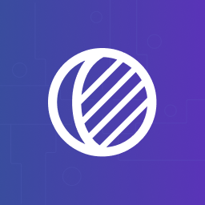

# Shadow Hackathon



----

[Shadow](https://tryshadow.xyz) is a developer platform that
allows you to modify any contract to generate custom onchain data.

This repo contains everything you need to get started writing
your own shadow events:
1. Example shadow contracts with shadow events.
1. Example unit tests to test your shadow contracts.
1. A CLI tool that allows you to run a light shadow fork
locally, and deploy a shadow contract to your hosted shadow fork.

----

# Prerequisites
1. Have [Foundry](https://github.com/foundry-rs/foundry) installed
1. An Ethereum RPC URL (you'll need both an HTTP and Websockets endpoint)
(e.g. https://eth-mainnet.g.alchemy.com/v2/abcdefg0123456789)
1. An Etherscan API key (get a free one [here](https://docs.etherscan.io/getting-started/viewing-api-usage-statistics))
1. A Shadow account (reach out to [@emilyhsia](https://github.com/emilyhsia)
if you still need to get set up with an account)

# Setup
**Est time: 5 mins**
1. Clone this repository
```bash
$ git clone git@github.com:shadow-hq/hackathon.git
```
2. Install the `shadow` CLI tool
```bash
# In the root of the project repo
$ cargo install --path cli
```
3. Set environment variables
```
ETH_RPC_URL=<http_rpc_url>
WS_RPC_URL=<ws_rpc_url>
ETHERSCAN_API_KEY=<etherscan_api_key>
SHADOW_PROJECT_ID=<your_project_id>
```

# Tutorial
**Est time: 10 mins**

This tutorial will walk you through the steps to create,
test, and deploy your first shadow contract -- the Uniswap V2
Router contract.

By the end of this tutorial, you will:

1. Edit the contract to add a shadow event.
1. Test that the shadow event is emitted via Foundry unit tests.
1. Run a local shadow fork with the shadow contract.
1. Deploy the shadow contract to your hosted shadow fork.

## Background
We will be adding a new `Trade` event to the Uniswap V2 Router
contract. The `Trade` event will represent a single top-level
trade, which may involve multiple underlying swaps between
liquidity pools.

This repository is initialized with everything you need for
this tutorial. It includes:
1. The original source code for the Uniswap V2
Router contract (in `contracts/src`)
1. A patch of shadow contract changes to apply (in `contracts/patches`)
2. Foundry unit tests that check that a `Trade` event is
emitted when a swap transaction occurs on the contract (in
`contracts/test`).

## Steps
*Note: Make sure you have completed the [setup](#setup) above
before going through this section.*

*Note: All commands should be run from the root of the project repo, unless
stated otherwise.*

### 0. Run the Foundry tests
```bash
$ forge test -vvv
```

You should see an output that looks like:
```bash
Test result: FAILED. 0 passed; 1 failed; 0 skipped; finished in 816.73ms
Ran 1 test suites: 0 tests passed, 1 failed, 0 skipped (1 total tests)

Failing tests:
Encountered 1 failing test in contracts/test/UniswapV2Router02.t.sol:UniswapV2Router02Test
[FAIL. Reason: Expected an emit, but the call reverted instead. Ensure you're testing the happy path when using the `expectEmit` cheatcode.] testSwapExactTokensForTokens_emitsTrade() (gas: 3495931)
```

The Foundry tests are expected to fail because we haven't made any
shadow contract changes yet. The Foundry tests check that a `Trade`
event is emitted when a swap transaction occurs on the contract.
Since the original Uniswap V2 router contract does not have the `Trade`
event, the tests will fail.

### 1. Apply the `trade` patch
```bash
$ git apply contracts/patches/trade.patch
```
A git patch is a small file that represents of a set of changes.
You can think of it as a text file that contains a git diff,
which you can apply to a repository.

Applying the patch will add a `Trade` event to the Uniswap V2 Router
contract. The `Trade` event will be emitted once for every top-level
swap transaction. Check out the patch diff here:

https://github.com/shadow-hq/hackathon/blob/c920b32e1748f40d37d2d047b6034e661efbfc32/contracts/patches/trade.patch#L1-L133

### 2. Run the Foundry tests again
```bash
$ forge test -vvv
```

Now you should see that the Foundry tests are passing after
we added the `Trade` event.

```bash
Running 1 test for contracts/test/UniswapV2Router02.t.sol:UniswapV2Router02Test
[PASS] testSwapExactTokensForTokens_emitsTrade() (gas: 3773314)
Test result: ok. 1 passed; 0 failed; 0 skipped; finished in 933.97ms
Ran 1 test suites: 1 tests passed, 0 failed, 0 skipped (1 total tests)
```

### 3. Verify on a local shadow fork
Now that we've tested our shadow contract, we're going to deploy
the contract onto a locally running shadow fork.

First deploy the shadow contract onto the shadow fork:
```bash
$ shadow deploy UniswapV2Router02.sol:UniswapV2Router02 0x7a250d5630b4cf539739df2c5dacb4c659f2488d
```

Then start the local shadow fork:
```bash
$ shadow fork
```

After a few seconds, you should see stdout logs that look like this, which
show that the shadow fork is receiving mainnet transactions.

```bash
    Transaction: 0xd23994e04d0f3fef2c900933552dda459c913849875d159521d214c72ee4774c
    Gas used: 155304

    Transaction: 0xaf2cc90e2e0509b1c818d90c404c4a6a1c6594d4470fa322a82651f96e94d04f
    Gas used: 147028

    Block Number: 17723714
    Block Hash: 0x3956ecce5f133b53aedc34a46ffc028917b39b3277bd1f424ecf654b57908929
    Block Time: "Wed, 19 Jul 2023 00:35:47 +0000"
```

Then, in a separate terminal window, run the following command to view a stream of
`Trade` events that are happening live on mainnet:
```bash
$ shadow events UniswapV2Router02.sol:UniswapV2Router02 Trade
```

You should start seeing output that looks like this:
```bash
=> Transaction: 0x67caf8bbb2192b3621cefb5b7a5f471e1a309317176d07a3b912b8c326c4a21b
{
  "platformName": "uniswap-v2",
  "contractAddress": "0x7a250d5630b4cf539739df2c5dacb4c659f2488d",
  "tokenInAddress": "0x5543862ba50b6bbc198222a34d30e93a62adce24",
  "tokenOutAddress": "0xc02aaa39b223fe8d0a0e5c4f27ead9083c756cc2",
  "amountIn": "1867527285719645",
  "amountOut": "758754486244361865",
  "senderAddress": "0x936e176e0e362d89e5b8b59fc96f61f77a7afa7a"
}
=> Transaction: 0xf51cf30855bf92ce01e57e9d7e65087c401b71cbc88420fda5e1731c03c698f9
{
  "platformName": "uniswap-v2",
  "contractAddress": "0x7a250d5630b4cf539739df2c5dacb4c659f2488d",
  "tokenInAddress": "0xc02aaa39b223fe8d0a0e5c4f27ead9083c756cc2",
  "tokenOutAddress": "0x03a053a158e115dcc1f4de56cbf2ce42ed88f1ca",
  "amountIn": "150000000000000000",
  "amountOut": "2235380042723567",
  "senderAddress": "0xe09b0e8b5370528ab4f84c278b229c670ad91f4f"
}
```
### 4. Deploy the shadow contract to your hosted shadow fork
Now that we've tested our shadow contract locally, we're going to
deploy the contract onto a hosted shadow fork.

TODO

# FAQs
### Why do I need an Etherscan API key?
You'll need an Etherscan API key to fetch the original source code for
a contract. You'll also need it to get the original contract creation
transaction for the shadowed contract, so that shadow can use the
original transaction to deploy the shadow contract.

You can get an Etherscan API key for free here:
https://docs.etherscan.io/getting-started/viewing-api-usage-statistics

Note: You only need an API key to run your own local shadow fork.
You do *not* need one when using the hosted Shadow product.

### How do I get the original source code for a contract?
You can use the Foundry's [`cast etherscan-source`](https://book.getfoundry.sh/reference/cast/cast-etherscan-source)
command to get the original source code for a contract.
```bash
$ cast etherscan-source <address> -d contracts/src
```

### Why am I seeing failed transactions on my local shadow fork?
This is expected. To reduce the CU cost of running a local shadow
fork, and to keep the local shadow fork latency to a minimum,
we only run a subset of the mainnet transactions on the local
shadow fork. This means that some transactions will fail on the
shadow fork because your local shadow fork does not have the exact
same state as mainnet.

**Your hosted shadow fork *will* have the exact same state as
mainnet**. Your hosted shadow node runs like a standard node,
and is latency optimized.

### How do I shadow a proxy contract?
To shadow a proxy contract, you need to shadow the proxy
implementation contract.

### How do I shadow a factory contract?
This is not supported locally. You can shadow a factory
contract on your hosted shadow fork.